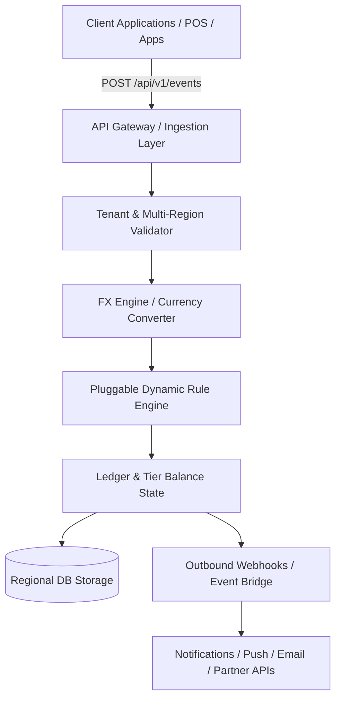

# 🌍 Anvaya: Universal, Headless Global Loyalty & Membership Engine

[](LICENSE)
[](https://dotnet.microsoft.com/)
[](#-code-architecture--system-design)
[](#-global-adaptability--multi-country-compliance)

**Anvaya** (derived from the ancient 5,000-year-old Sanskrit word for *"Connection"*, *"Sequence"*, or *"Linkage"*) is a high-performance, developer-first, event-driven loyalty, rewards, and membership engine built on **.NET Core**. 

Architected with **completely abstract business entities**, Anvaya allows enterprise platforms across **any industry vertical**—E-commerce, Dining, Aviation, SaaS, Gaming, or Fintech—to plug in their transaction pipelines and seamlessly launch adaptable, multi-country customer retention mechanics globally.

---

## 🌟 Why Anvaya? (Core Objectives)

Traditional loyalty systems are rigid, locked to specific currencies, bound to single domains, or non-compliant with cross-border regulations. **Anvaya** solves this by providing:

* **🌍 100% Multi-Country Adaptability:** Native cross-border multi-currency ledger, localized tax compliance, and timezone-aware rule execution.
* **🔌 Ultra-Easy Integration:** Headless REST, GraphQL, gRPC, and Webhook APIs that can be embedded into any mobile app, web app, POS system, or backend pipeline within hours.
* **🏢 Any-Industry Flexibility:** Dynamic rule engine with zero hardcoded business schemas—supports points, tiers, streaks, household pooling, cashbacks, coalition loyalty, and paid VIP subscriptions.
* **🛡️ Enterprise Multi-Tenancy & Data Sovereignty:** Strict tenant isolation supporting regional data residency requirements (GDPR, CCPA, DPDP).

---

## ✨ Enterprise-Grade Features Built In

### 1. Global & Cross-Border Mechanics
* **Universal Event Ingestion Engine:** Accepts arbitrary, dynamic metadata keys (e.g., `SKU`, `CabinClass`, `StoreLocation`, `GameLevel`) without schema migrations to evaluate customized reward logic.
* **Cross-Border Exchange Matrix:** Processes events in localized fiat currencies (e.g., `INR`, `EUR`, `JPY`, `USD`) and automatically converts, tracks financial liability, and mints points in the tenant’s or member's `BaseCurrency`.
* **Unified Timezone Isolation:** Prevents campaign boundaries from breaking across international time zones. Events are persisted in strict `UTC`, while business rules execute in the tenant’s native IANA timezone.
* **Multi-Lingual & Localization Ready:** Configurable notifications and reward messaging for local languages and right-to-left (RTL) scripts.

### 2. Flexible Loyalty & Reward Models
* **Multi-Tier & Gamification Engine:** Dynamic tier evaluation (e.g., Bronze, Silver, VIP), badges, streaks, and milestone unlocking based on custom earn velocity.
* **Household & Organization Pooling:** Enables connected user accounts (families, corporate teams, gaming squads) to pool balances into a single shared ledger ecosystem.
* **Subscription & VIP Membership Framework:** Native support for paid premium memberships (e.g., Amazon Prime-style programs) unlocking instant tier upgrades, point multipliers, and exclusive perks.
* **Flexible Point Expiration & Decay:** Supports rolling expiration (e.g., points expire 12 months after earn unless activity occurs) and fixed calendar decay rules.

### 3. Redemptions & Partner Ecosystem
* **Universal Redemption Engine:** Point redemptions, vouchers, discount coupons, gift cards, and "Points + Cash" hybrid checkout payments.
* **Coalition & Partner Cross-Earning:** API hooks for third-party partner integration, allowing members to earn or redeem points across partner ecosystems.

### 4. Security & Anti-Fraud
* **Real-time Velocity & Anomaly Detection:** Protects campaigns against fraudulent ingestion, duplicate events, and point-farming bot abuse.
* **Idempotent Transaction Processing:** Guarantees zero double-crediting via strict event key deduplication.

---

## 🏛️ Code Architecture & System Design

Anvaya strips away domain-specific definitions by relying on an abstract **Rules Engine Middleware Strategy**. The architecture processes event ingestion requests through a pipeline of pluggable filters:



### Pipeline Flow:
1. **Ingestion & Idempotency:** Validates tenant identity, API keys, signature, and idempotency key.
2. **Context Normalization:** Converts transaction amounts to the tenant's base financial valuation using real-time or pinned FX rates, and maps local timestamps to UTC.
3. **Dynamic Rule Evaluation:** Runs tenant-defined JsonLogic/CEL scripts to calculate points awarded, tier adjustments, or bonus triggers.
4. **Atomic Ledger Execution:** Appends double-entry balance records to the member ledger and updates tier status atomically.
5. **Outbound Dispatch:** Triggers outbound webhooks, push notifications, or partner fulfillment APIs.

---

## 🛠️ Quick Start & Local Environment Orchestration

Anvaya includes full **DevEnv** and **Docker** integration. You do not need to manually configure runtime environments to get started.

### Option 1: Using DevEnv (Recommended)

1. Ensure you have [devenv](https://devenv.sh) installed.
2. Clone the repository and enter the directory:
   ```bash
   git clone https://github.com/your-org/anvaya.git
   cd Anvaya
   ```
3. Initialize the development shell and launch the API runtime:
   ```bash
   devenv up
   ```
   *The engine will initialize an isolated datastore directory and launch the hot-reloaded Web API listener on `http://localhost:5000`.*

### Option 2: Using Docker Compose

```bash
docker-compose up --build -d
```

---

## 🔌 Core API Integration Contracts

### 1. Ingest Global Business Event
Clients emit user actions directly to this unified endpoint.

* **Endpoint:** `POST /api/v1/events`
* **Headers:** `X-Tenant-ID: tenant_global_retail`, `Idempotency-Key: evt_8f93a10`
* **Sample Payload (Cross-Border Purchase):**

```json
{
  "tenantId": "tenant_global_retail",
  "customerId": "cust_india_traveler",
  "eventName": "PurchaseCompleted",
  "value": 8000.00,
  "currency": "INR",
  "attributes": {
    "Category": "Electronics",
    "CabinClass": "Business",
    "StoreLocation": "DEL-T3",
    "Channel": "MobileApp"
  }
}
```

* **Engine Response Return:**

```json
{
  "status": "Success",
  "eventId": "evt_8f93a10",
  "message": "Event processed universally by Anvaya Engine.",
  "pointsAwarded": 200,
  "newBalance": 1450,
  "calculatedTier": "Silver",
  "tierUpgraded": true,
  "processedUtcTime": "2026-10-03T05:24:27Z",
  "processedLocalTime": "2026-10-03 10:54:27 IST"
}
```

---

### 2. Retrieve Member Profile & Loyalty Snapshot
Extract a holistic member object snapshot to bind live user interface cards.

* **Endpoint:** `GET /api/v1/members/{customerId}?tenantId={tenantId}`
* **Response Return:**

```json
{
  "customerId": "cust_india_traveler",
  "tenantId": "tenant_global_retail",
  "pointsBalance": 1450,
  "currentTier": "Silver",
  "nextTier": "Gold",
  "pointsToNextTier": 550,
  "isPremiumSubscriber": true,
  "householdId": "house_sharma_family",
  "preferredLanguage": "en-IN",
  "currency": "INR"
}
```

---

### 3. Redeem Points / Apply Rewards
Process point redemptions or voucher redemption during checkout.

* **Endpoint:** `POST /api/v1/redemptions`
* **Sample Payload:**

```json
{
  "tenantId": "tenant_global_retail",
  "customerId": "cust_india_traveler",
  "rewardId": "rwd_flight_discount_50",
  "pointsToRedeem": 500,
  "referenceOrderId": "ORD-2026-9912"
}
```

* **Response Return:**

```json
{
  "redemptionId": "red_98231a4",
  "status": "Approved",
  "pointsDeducted": 500,
  "remainingBalance": 950,
  "voucherCode": "FLYSAFE50-DEL",
  "expiresAt": "2026-12-31T23:59:59Z"
}
```

---

## 🌐 Global Adaptability & Multi-Country Compliance

| Capability | Strategy | Implementation |
| :--- | :--- | :--- |
| **Data Sovereignty** | Isolated Tenant Data Backends | Dynamic DB routing to regional nodes (EU, US, APAC, India). |
| **Privacy Compliance** | Right-to-be-Forgotten & Anonymization | Built-in GDPR/CCPA data purgers and tokenized PII fields. |
| **Currency Handling** | Dynamic FX Exchange Rate Engine | Real-time integrations with ECB / OpenExchangeRates APIs. |
| **Financial Liability** | Double-Entry Audit Ledger | Tracks unredeemed points liability balance for enterprise accounting. |

---

## 🗺️ Extension Roadmap & SDKs

- [x] Core Event Ingestion & Rule Pipeline
- [x] Multi-Currency FX Engine Matrix
- [x] Household & Family Balance Pooling
- [ ] **SDK Libraries:** Official Node.js, Python, Go, and Java client SDKs
- [ ] **E-commerce Plug-ins:** Shopify, WooCommerce, & Magento 2 connectors
- [ ] **Visual Rule Builder:** No-code drag-and-drop rule engine UI for marketing teams
- [ ] **AI-Powered Personalization:** Dynamic reward recommendation engine based on user spend velocity

---

## 🤝 Contributing & License

Contributions are welcome! Please view our [CONTRIBUTING.md](CONTRIBUTING.md) guide for instructions on submitting pull requests and reporting issues.

Distributed under the **MIT License**. See `LICENSE` for more information.
